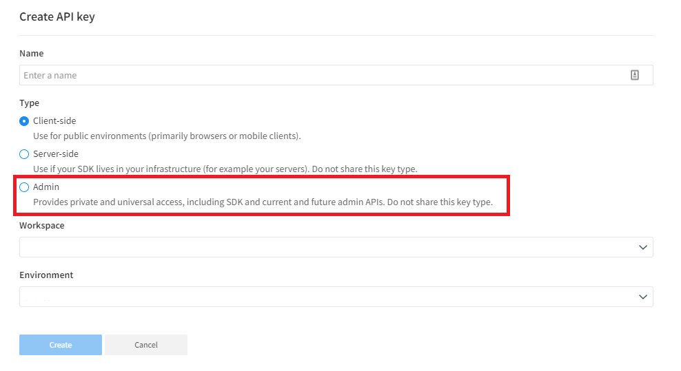

# SplitAdmin

A C# wrapper around the split.io admin API.

## Getting started

Getting started is super easy. First up, you need to generate an "Admin key" in Split. 



Now, you can create your client in code:

```csharp
var client = SplitClient("API_KEY_HERE");
```

With that client, you are ready to call the APIs.

The APIs are "namespaced" into areas matching the [official documentation](https://docs.split.io/reference/introduction). 

So, for example, if you wanted to get the workspaces, you'd do:

```csharp
var workspaces = await client.Workspaces.GetAll();
```
